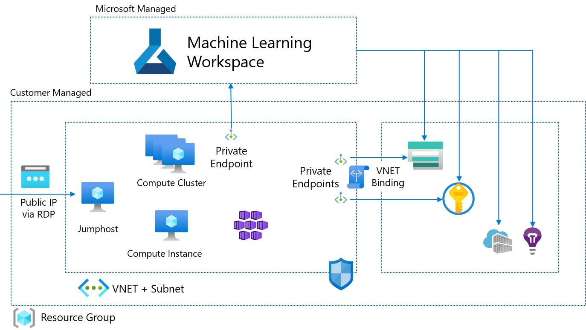

# azure-machine-learning-terraform

This repo shows an example for rolling out a complete Azure Machine Learning enterprise enviroment via Terraform.



This includes rollout of the following resources:

* Azure Machine Learning Workspace with Private Link
* Azure Storage Account with VNET binding (using Service Endpoints) and Private Link for Blob and File
* Azure Key Vault with VNET binding (using Service Endpoints) and Private Link
* Azure Container Registry
* Azure Application Insights
* Virtual Network
* Jumphost (Windows) for testing

## Instructions

1. Copy `terraform.tfvars.example` to `terraform.tfvars`
1. Update `terraform.tfvars` with your desired values
2. Run Terraform
    ```console
    $ terraform init
    $ terraform plan
    $ terraform apply
    ```

# Known Limitations

* Still need to update `Default Datastore` to use Managed Identity of the Studio UI data access

# Important Notes

* The fileshare used for Compute Instances will be automatically provisioned with the first Compute Instance